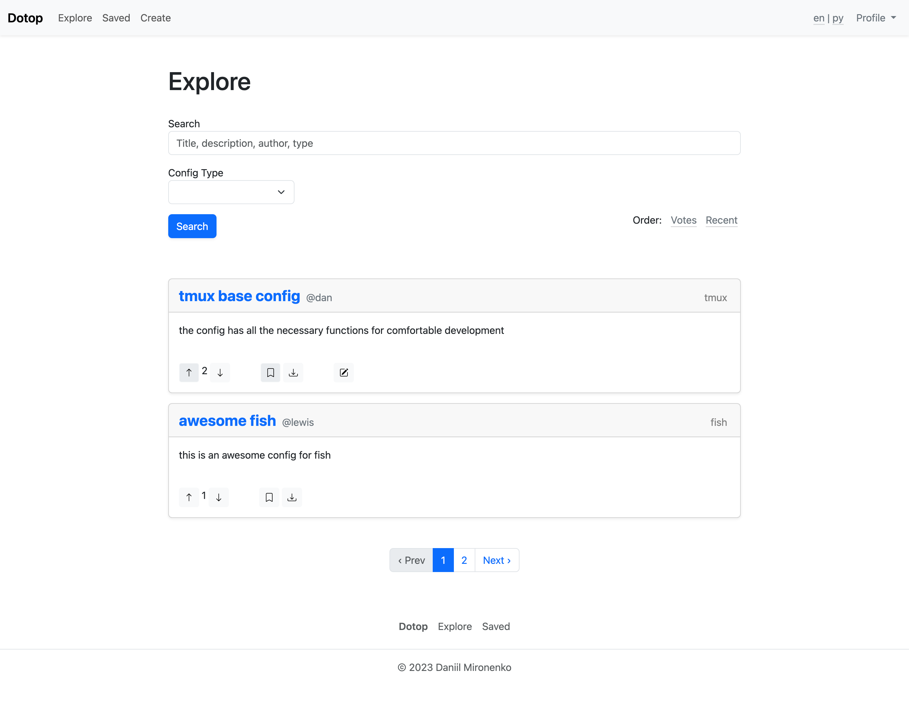

<div align="center">

# Dotop

dotfile sharing service that I created as homework for the course "Internet
programming languages" at the cs6 department of bmstu

</div>

## Contents

* [Images](#images)
* [Installation](#installation)
    * [MacOS & Linux](#macos-linux-installation)
* [Testing](#testing)

## Images <a name="images"></a>


---



## Installation <a name="installation"></a>

### MacOS & Linux <a name="macos-linux-installation"></a>

1. Install gems:

```sh
bundle install
```

2. Apply migrations:

```sh
bin/rails db:migrate
```

3. Run server:

```sh
bin/rails s -p 3000
```

4. Enjoy the service on `localhost:3000`

## Testing <a name="testing"></a>

Run unit and integration tests (from root):

```sh
bundle exec rspec ./spec
```
